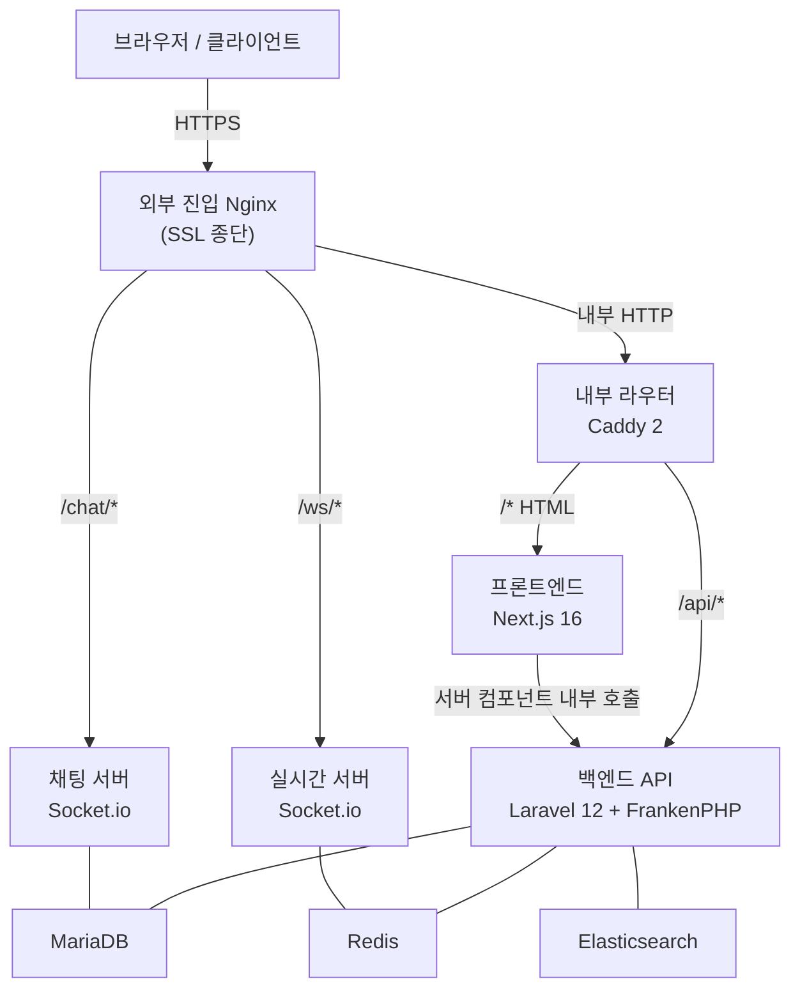

# 시스템 아키텍처

## 개요

학점은행제·자격증 과정을 통합 운영하는 풀스택 LMS입니다. 학습자·튜터·교수자·관리자 4역할을 지원하며, NILE 평가인정 정합·시험 도메인·AI 학습 도우미·강좌 추천·실시간 진도 추적을 핵심 도메인 범위로 구현합니다.

---

## 🗺 서비스 토폴로지

### 내부 서비스

| 서비스 | 기술 | 역할 |
|---|---|---|
| 내부 라우터 | Caddy 2 | 경로 기반 내부 라우팅 · SSE 버퍼링 해제 |
| 백엔드 API | Laravel 12 + FrankenPHP (Worker Mode) | REST API 서버 · 도메인 로직 |
| 프론트엔드 | Next.js 16 (standalone) | SSR 학습자·운영자 UI |
| 실시간 서버 | Node.js + Socket.io | 학습 진도 하트비트 · 실시간 이벤트 |
| 채팅 서버 | Node.js + Socket.io | 1:1 문의 채팅 |
| 큐 워커 | Laravel Queue (redis 드라이버) | 비동기 작업 처리 |
| 스케줄러 | Laravel Scheduler | 주기적 태스크 실행 |

### 외부 공유 인프라

| 서비스 | 기술 | 역할 |
|---|---|---|
| 데이터베이스 | MariaDB 10.11 | 주 영속 데이터 |
| 캐시·큐·세션 | Redis 7 | 세션 스토어 · 큐 백엔드 · 추천 캐시 · AI 이력 |
| 전문 검색 | Elasticsearch 8 | 한국어 nori 형태소 + ngram 전문 검색 |

공유 인프라는 LMS 외부 별도 컴포즈로 관리됩니다. LMS 서비스 컴포즈는 외부 네트워크를 통해 연결만 합니다. LMS 재시작 시 데이터 계층에 영향이 없고, 동일 인프라를 다른 서비스와 함께 사용할 수 있습니다.

---

## 🔄 요청 흐름

### 경로별 처리

| 경로 패턴 | 처리 서비스 | 특이사항 |
|---|---|---|
| `/api/my/ai/*` | 백엔드 API | SSE flush 즉시 설정 — 응답 버퍼링 없이 스트리밍 |
| `/api/*` | 백엔드 API | REST JSON 응답 |
| `/ws/*` | 실시간 서버 | Socket.io 진도 하트비트 |
| `/*` (나머지) | 프론트엔드 | Next.js SSR |

---

## ⚙️ 핵심 아키텍처 결정

### 1. FrankenPHP Worker Mode

PHP 프로세스를 재사용하는 Worker Mode를 채택했습니다. 기존 PHP-FPM 방식은 요청마다 프로세스를 생성·종료하여 Laravel 부트스트랩 비용이 반복 발생합니다. FrankenPHP Worker Mode는 Laravel 애플리케이션을 메모리에 상주시켜 초기화 비용을 최초 1회로 줄이고, 이후 요청은 이미 부트스트랩된 인스턴스가 처리합니다.

### 2. Caddy 내부 라우터

외부 SSL 종단(Nginx) 이후 내부 경로 라우팅을 전담합니다. 핵심 역할은 두 가지입니다.

- **경로 기반 분기** — `/api/*`와 나머지 경로를 백엔드·프론트엔드로 분기
- **SSE 버퍼링 해제** — AI 스트리밍 엔드포인트에서 `flush_interval -1` 설정으로 응답을 버퍼링 없이 즉시 전달

Nginx의 SSE 스트리밍 버퍼링 제어는 설정이 복잡하고 이중 프록시를 거치면 flush 보장이 불확실합니다. Caddy는 해당 설정을 단일 지시어로 처리합니다.

### 3. AI 응답에 SSE, 진도·채팅에 Socket.io 분리

AI 응답(서버→클라이언트 단방향 스트리밍)에는 WebSocket 대신 SSE를 채택했습니다. SSE는 HTTP/1.1 호환이고 단방향 용도에 구조적으로 적합하며, 재연결·이벤트 ID를 브라우저가 자동 처리합니다. 학습 진도 하트비트·1:1 문의 채팅 등 양방향 통신은 Socket.io 전용 서버로 분리하여 백엔드 프로세스 부하를 격리했습니다.

### 4. Redis 4종 용도 분리

단일 Redis 인스턴스를 논리적으로 분리하여 사용합니다.

| 용도 | 설명 |
|---|---|
| 세션 스토어 | API 인증 세션 |
| 추천 캐시 | 강좌 추천 결과 (TTL 600초) |
| 큐 백엔드 | 비동기 작업 처리 |
| AI 이력 | AI 학습 도우미 대화 이력 |

### 5. 외부 공유 인프라 분리

MariaDB·Redis·Elasticsearch를 LMS 서비스 외부에서 별도 컴포즈로 관리합니다. LMS 서비스 컴포즈 재시작·재빌드가 데이터 계층에 영향을 주지 않으며, 동일 DB·캐시·검색 인덱스를 여러 서비스가 공유할 수 있습니다.

---

## 📋 도메인 영역 매트릭스

| 도메인 영역 | 핵심 기능 | 상태 |
|---|---|---|
| 수강·진도 관리 | 수강 등록·정원 통제·콘텐츠 진도 추적·출석 자동 산정 | ✅ |
| 학점 관리 | 출석 80% 게이트·학점 신청·NILE 평가인정 정합 | ✅ |
| 이의신청 워크플로우 | 비동기 티켓 (신청→검토→답변) · 14일 기간 자동 산정 | ✅ |
| 시험 도메인 | 문제은행·시험지 구성·응시 스냅샷·채점·복제·4배수 풀 검증 | ✅ |
| 학기·강좌 개설 | 학기 4단계 phase 통제·강좌 개설 관리 | ✅ |
| 자격증 발급 | 자격증 마스터·합격 기준·QR 코드 검증 | ✅ |
| 결제·환불 | 결제 추상화·환불 처리 | ✅ |
| 강좌 추천 | 3종 알고리즘·Redis 캐싱·비로그인 폴백 | ✅ |
| AI 학습 도우미 | Provider 4종 추상화·SSE 스트리밍·차시 컨텍스트 주입 | ✅ |
| 1:1 문의 채팅 | 학습자·운영자 실시간 채팅 | ✅ |
| 학습 노트·하이라이트 | 차시별 시점 메모·하이라이트 5색·타임스탬프 seek | ✅ |
| 통합 검색 | 학습자·강좌·시험·주문 통합 전문검색 | ✅ |
| 통계·리포팅 | 이수율·완료율·KPI·DAU | ✅ |
| 공개 콘텐츠 | 공지·FAQ·정적 페이지 | ✅ |

---

<!--
문서 갱신 가이드:
- 신규 서비스 추가 시 "서비스 토폴로지" 표에 행 추가
- 아키텍처 결정 변경 시 해당 항목 갱신 (변경 이력은 git commit에 보존)
- 도메인 영역 추가·완료 시 "도메인 영역 매트릭스" 표 갱신
-->
